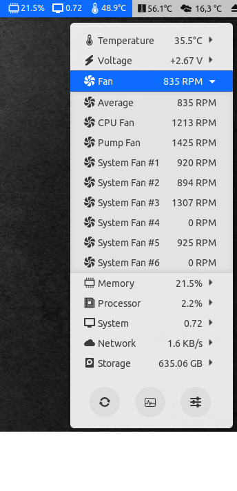
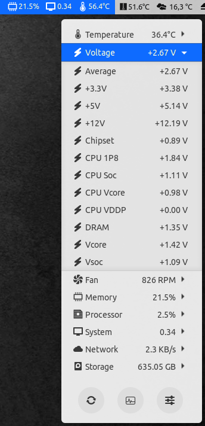

# NCT6687D Kernel module

This kernel module permit to recognize the chipset Nuvoton NCT6687-R in lm-sensors package.
This sensor is present on some B550 motherboard such as MSI or ASUS.

The implementation is minimalist and was done by reverse coding of Windows 10 source code from [LibreHardwareMonitor](https://github.com/LibreHardwareMonitor/LibreHardwareMonitor)
<br><br>

## Installation
### via package manager
#### .deb package
- Clone this repository
```shell
~$ git clone https://github.com/Fred78290/nct6687d
~$ cd nct6687d
```
- Build package
```shell
~$ make deb
```
- Install package
```shell
~$ dpkg -i ../nct6687d-dkms_*.deb
```
<br>

#### .rpm package (akmod)
- Clone this repository
```shell
~$ git clone https://github.com/Fred78290/nct6687d
~$ cd nct6687d
```
- Build & install package
```shell
~$ make akmod
```
<br><br>

### Manual Install
#### Dependencies:
- Ubuntu/Debian:
	 ```apt-get install build-essential linux-headers-$(uname -r) dkms dh-dkms```
- Fedora/CentOS/RHEL:
	```yum install make automake gcc gcc-c++ kernel-devel kernel-headers dkms```
- ArchLinux:
	 ```pacman -S make automake linux-firmware linux-headers dkms base-devel```
- openSUSE:
	 ```zypper in git make gcc dkms```
<br>

#### Build with DKMS
```shell
~$ git clone https://github.com/Fred78290/nct6687d
~$ cd nct6687d
~$ make dkms/install
```
<br>

#### Manual build
```shell
~$ git clone (this-repo)
~$ cd nct6687d
~$ make install
```
<br>

## Sensors

By running the command sensors, you got this output

```
nct6687-isa-0a20
Adapter: ISA adapter
+12V:           12.17 V  (min = +12.17 V, max = +12.19 V)
+5V:             5.14 V  (min =  +5.14 V, max =  +5.14 V)
+3.3V:           3.38 V  (min =  +3.38 V, max =  +3.38 V)
CPU Soc:         1.11 V  (min =  +1.11 V, max =  +1.11 V)
CPU Vcore:       1.05 V  (min =  +0.97 V, max =  +1.05 V)
CPU 1P8:         1.84 V  (min =  +1.84 V, max =  +1.84 V)
CPU VDDP:        0.00 V  (min =  +0.00 V, max =  +0.00 V)
DRAM:            1.34 V  (min =  +1.34 V, max =  +1.35 V)
Chipset:       890.00 mV (min =  +0.89 V, max =  +0.89 V)
CPU Fan:       1192 RPM  (min = 1192 RPM, max = 1202 RPM)
Pump Fan:      1538 RPM  (min = 1526 RPM, max = 1538 RPM)
System Fan #1:  922 RPM  (min =  920 RPM, max =  922 RPM)
System Fan #2:  953 RPM  (min =  953 RPM, max =  953 RPM)
System Fan #3: 1393 RPM  (min = 1393 RPM, max = 1393 RPM)
System Fan #4:    0 RPM  (min =    0 RPM, max =    0 RPM)
System Fan #5: 1007 RPM  (min = 1007 RPM, max = 1007 RPM)
System Fan #6:    0 RPM  (min =    0 RPM, max =    0 RPM)
CPU:            +59.0°C  (low  = +52.0°C, high = +59.0°C)
System:         +34.0°C  (low  = +34.0°C, high = +34.0°C)
VRM MOS:        +31.0°C  (low  = +31.0°C, high = +31.0°C)
PCH:            +40.0°C  (low  = +40.0°C, high = +40.0°C)
CPU Socket:     +33.0°C  (low  = +33.0°C, high = +33.0°C)
PCIe x1:        +32.0°C  (low  = +32.0°C, high = +32.0°C)
M2_1:            +0.0°C  (low  =  +0.0°C, high =  +0.0°C)
```

<br>

## Load(prob) Sensors on boot

To make it loaded after system boots

Just add nct6687 into /etc/modules

`sudo sh -c 'echo "nct6687" >> /etc/modules'`

### Arch-Linux with systemd

`sudo sh -c 'echo "nct6687" >> /etc/modules-load.d/nct6687.conf'`

<br>

## Gnome sensors extensions

 

<br>

## Tested

This module was tested on Ubuntu 20.04 with all kernel available on motherboard [MAG-B550-TOMAHAWK](https://www.msi.com//Motherboard/MAG-B550-TOMAHAWK) running an [AMD 3900X/AMD 5900X](https://www.amd.com/en/products/cpu/amd-ryzen-9-3900x), and on RL8(RHEL8) [MAG-B550M-MORTAR](https://www.msi.com/Motherboard/MAG-B550M-MORTAR) running an [AMD 5700G](https://www.amd.com/en/products/apu/amd-ryzen-7-5700g)

<br>

## Other motherboard supported
- Many people have reported compatibility with MB having Intel H410M & H510M chipset from some manufacturer. See [issue](https://github.com/Fred78290/nct6687d/issues) report.
<br>

## CHANGELOG

- Add support for MSI B460M Bazooka having NCT6687 with another device ID
- Add support to use generic voltage input without multiplier, allows sensors custom conf
- Support giving fan control back to the firmware
<br>

## VOLTAGE MANUAL CONFIGURATION

Some people report that voltage are wrong. The reason is with some motherboard, voltage sensors are not connected on the same nct6687 register.

As example the **VCore** sensor is connected on the **5th** register for AMD but is connected on the **3rd** register for INTEL.
<br>
Also the **DIMM** sensor is connected on the **4th** register for AMD but connected to **5th** register for INTEL.

To allow customize voltage configuration you must add **manual=1** parameter passed to the module at load

`sudo sh -c 'echo "nct6687 manual=1" >> /etc/modules'`

And use a sensors conf like this **/etc/sensors.d/B460M-7C83.conf**

```
# Micro-Star International Co., Ltd.
# MAG B460M BAZOOKA (MS-7C83)

chip "nct6687-*"
    label in0         "+12V"
    label in1         "+5V"
    label in2         "VCore"
    label in3         "Voltage #1"
    label in4         "DIMM"
    label in5         "CPU I/O"
    label in6         "CPU SA"
    label in7         "Voltage #2"
    label in8         "+3.3V"
    label in9         "VTT"
    label in10        "VRef"
    label in11        "VSB"
    label in12        "AVSB"
    label in13        "VBat"

    ignore in3
    ignore in7
    ignore in9
    ignore in10
    ignore in13

    ignore temp6
    ignore temp7

    compute in0       (@ * 12), (@ / 12)
    compute in1       (@ * 5), (@ / 5)
    compute in4       (@ * 2), (@ / 2)
```

## MODULE PARAMETERS

- **force** (bool) (default: false)
  Set to enable support for unknown vendors.

- **manual** (bool) (default: false)
  Set voltage input and voltage label configured with external sensors file.
  You can use custom labels and ignore inputs without setting this option if
  you can figure out their names (see which `*_label` contains builtin label).

## CONFIGURATION VIA SYSFS

In order to be able to use this interface you need to know the path as which
it's published. The path isn't fixed and depends on the order in which chips are
registered by the kernel. One way to find it is by device class (`hwmon`) via a
simple command like this:
```
for d in /sys/class/hwmon/*; do echo "$d: $(cat "$d/name")"; done | grep nct6687
```

Possible output:
```
/sys/class/hwmon/hwmon5: nct6687
```

This means that your base path for examples below is `/sys/class/hwmon/hwmon5`
(note that adding/removing hardware can change the path, drop `grep` from the
command above to see all sensors and their relative ordering).

Another way to look it up is by a device (class path actually just points to
device path) like in:

`cd /sys/devices/platform/nct6687.*/hwmon/hwmon*`

The first asterisk will be expanded to an address (`2592` which is `0xa20` that
you can see in `sensors` output) and the second one to a number like `5` from
above.

### `pwm[1-8]`

Gets/sets PWM duty cycle or DC value that defines fan speed.  Which unit is used
depends on what was configured by firmware.

Accepted values: `0`-`255` (slowest to full speed).

Writing to this file changes fan control to manual mode.

Example:

```
# slow down a fan as much as possible (will stop it if the fan supports zero RPM mode)
echo 0 > pwm6
# fix a fan at around half its speed (actual behaviour depends on the fan)
echo 128 > pwm6
# full speed
echo 255 > pwm6
```

### `pwm[1-8]_enable`

Gets/sets controls mode of fan/temperature control.

Accepted values:
 * `1` - manual speed management through `pwm[1-8]`
 * `99` - whatever automatic mode was configured by firmware
          (this is a deliberately weird value to be dropped after adding more
           modes)

Example:

```
# fix a fan at current speed (`echo pwm6` will be constant from now on)
echo 1 > pwm6_enable
# switch back to automatic control set up by firmware (`echo pwm6` is again dynamic after this)
echo 99 > pwm6_enable
# switch to ~25% of max speed
echo 64 > pwm6
# automatic
echo 99 > pwm6_enable
# back to ~25% (it seems to be remembered)
echo 1 > pwm6_enable
```

## VERIFIED
**1. Fan speed control**

- Changing fan speed was tested successfully by users, see in [reported issues](https://github.com/Fred78290/nct6687d/issues).

## Issues
### ACPI
loading nct6687 fails. `journalctl` shows `ACPI: OSL: Resource conflict; ACPI support missing from driver?`:
* add `acpi_enforce_resources=lax` as a kernel parameter

### Loading fails during startup
`dmesg` / `journalctl` shows 
```
kernel: nct6687: EC base I/O port unconfigured
systemd-modules-load[339]: Failed to insert module 'nct6687': No such device
```
* add `softdep nct6687 pre: i2c_i801` to e.g. `/etc/modprobe.d/sensors.conf`.
